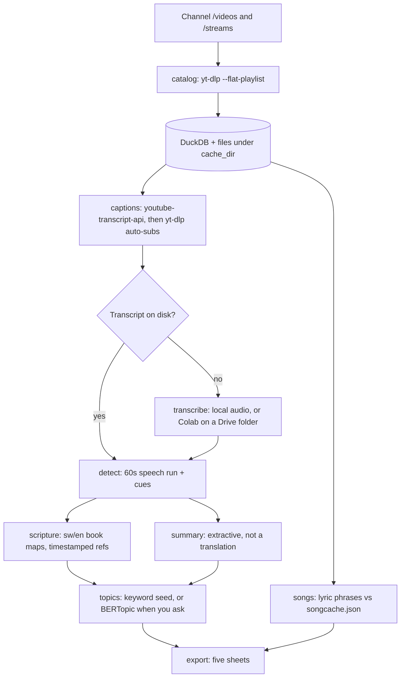

# sermon-insights

Point it at a church YouTube channel. It comes back with the sermon window, the verses that were actually spoken, a few lines lifted straight from the transcript, a broad theme, and the worship songs the lyrics support. The channel in the config is yours to choose. The package does not ship anyone's livestreams.

Chris Nguu built the first version of this while studying public Kiswahili services: captions first, Whisper when the captions give out, and a refusal to print a verse or a song title the audio did not earn. This repository is that workflow, cleaned into one installable package. Summaries here are extractive. Themes are a keyword seed unless you turn BERTopic on. Weak hits stay in the sheet with `(verify)`.

No YouTube Data API. No API key. No account.

## What a finished run contains

One Excel workbook, five sheets, plus a CSV twin of each sheet when `export_csv` is on:

| Sheet | What landed there |
| --- | --- |
| Sermons | Date, title, detected span, confidence, extractive summary, opening in the original language, theme, main passage |
| Scripture | English book names, confidence, the matched phrase, a timestamped YouTube link |
| Worship Songs | Each sung block, official title when the lyric cache agrees, artist, link |
| Song List | Titles that cleared the confidence rule, and a footer counting what was left off |
| Topics & Verses | One row per theme, then the sermons under it, with the verses they quoted |

Everything resumable sits in a local cache: DuckDB for the tables, JSON for transcripts and the song cache. A second run does not download a file that is already there.

## How a video moves



Kiswahili is the default speech language. English aliases sit in the same book map, so a mixed line still normalises to one English reference (`Zaburi` and `Psalms` both become Psalms). Another language is a YAML file; see [CONTRIBUTING.md](CONTRIBUTING.md).

## Stages

`sermon run` walks all of these. Any one of them can be repeated on its own. Network stages skip work when the artifact exists. Analysis stages recompute from those files, which is cheap and does not touch YouTube.

**catalog.** `yt-dlp --flat-playlist -J` on `<channel>/videos` and `<channel>/streams`. Public videos only. Private and deleted titles are dropped. `since` keeps uploads on or after that date. A title with WORD, sermon, mahubiri, or ujumbe is a sermon; praise and worship or sifa (without WORD) is worship. A long livestream is treated as a likely sermon even when the title is vague. The raw JSON is kept, so the next catalog does not refetch.

**captions.** `youtube-transcript-api` first, languages in config order, then `yt-dlp --write-auto-subs` for `sw-orig` and `en-orig` json3. A `subs/<id>.none` marker records a confirmed miss. `--force` deletes only those markers. Files that were actually saved stay put. Swahili captions win over a Whisper file when both exist.

**transcribe.** faster-whisper, only for videos that still have no captions and no transcript. CPU default is `small` / `int8`. CUDA default is `medium` / `float16`. Language defaults to `sw`. Singing is not speech: worship audio uses `vad_filter=False` and `condition_on_previous_text=False`, because the VAD treats melody as silence and a conditioned decoder loops a chorus. Speech keeps a light VAD and the same anti-loop flag. YouTube blocks Colab IP ranges, so this stage downloads audio on your machine. Set `drive_dir` and it also writes 16 kHz mono Opus into that folder for the notebook. The notebook never calls yt-dlp.

**detect.** Each minute is speech when it has at least 25 words, a unique-word ratio of at least 0.42, and no `[music]` tag. The longest run is kept, with up to three missing minutes inside it. The first and last speech bins have to sit at least ten bins apart (`last - first >= 10`). Start cues (`tufungue`, `open your bible`, `tusome`, …) within five minutes pull the start; end cues (`tuombe`, `let us pray`, `simama`, …) pull the end. High confidence needs a run of at least 20 minutes, a speech fraction of at least 0.85, a start cue, and a Swahili-caption or Whisper source.

**scripture.** Book aliases, Swahili number words (`kumi na tatu` → 13, and the same words in any case), chapter cues (`sura ya`, `kifungu cha`, `chapter`), verse cues (`mstari wa`, `verse`), ranges (`hadi`, `mpaka`, `to`). High means an explicit chapter and verse. Medium means a verse or an explicit chapter. Low means a bare book, an implausible number, or run-together digits such as `Exodus 1718` read as 17:18. Low references are kept and rendered with `(verify)`. Bare ambiguous names (Mark, John, Luka, Mwanzo, Kutoka, …) with no number are skipped, because those words show up as names and as books.

**songs.** 30-second windows. A cached lyric phrase counts when it is at least 8 letters after spaces are stripped, and it is not on the stoplist of chorus fragments everyone sings. Phrases of 14 letters or more may fuzzy-match. The cache confidence is kept only when two or more distinct phrases show up in two or more windows. One phrase in one window is `low` and the title is marked `(verify)`. Those rows stay on Worship Songs and stay off Song List. A block with no phrase is `Unidentified`. New candidate titles, when you are online, come from a throttled `yt-dlp ytsearch` whose JSON is cached under `_queries` in `songcache.json` so the same phrase is never searched twice.

**topics.** Twelve keyword themes in `data/themes.yaml` score the sermon text plus the quoted verses. That label is what you get when `topics.backend` is `keyword`, when the run has fewer than `min_docs` sermons, or when the `[topics]` extra is not installed. With the extra, enough sermons, and `backend: bertopic` or `auto`, BERTopic clusters the documents using those seed words and a multilingual sentence-transformer. The sheet's Theme method column says which path ran. It does not relabel a keyword result as BERTopic.

**export.** openpyxl workbook. Header row `#305496`. Confidence cells use green / amber / red. Low scripture rows are tinted. CSV files are written beside the xlsx.

The summary column is named **Summary (extractive)** on purpose. Sentences are copied from the transcript and ranked by overlap with the other sentences. If you set `summary.backend: embedding` and sentence-transformers is installed, the same sentences are ranked by similarity to their centroid. Nothing is paraphrased and nothing is translated. When the extract does not look like English, the cell says so.

## Install

Python 3.11 or 3.12.

```bash
python -m pip install -e ".[dev]"
sermon --help
```

Optional extras:

```bash
python -m pip install -e ".[topics]"   # BERTopic + sentence-transformers
python -m pip install -e ".[gpu]"      # nvidia-cublas / nvidia-cudnn wheels used on Colab
```

Direct dependencies are pinned in `pyproject.toml`. `requirements.lock` is a `pip freeze` of a clean virtualenv after `pip install -e ".[dev]"` (the editable project line removed). GPU and topic stacks are not in that freeze; their pins are the extras in `pyproject.toml`.

## Try it with no network

The fixture under `samples/offline/fixture/` is synthetic: one sermon, one worship set, a private video, and a stream from before `--since`. No real channel, no preacher, no full transcript.

```bash
sermon run --config samples/offline/config.yaml
```

That writes `samples/example/sermon_insights_sample.xlsx` and five CSV files next to it. Tests use the same fixture and monkeypatch `subprocess` so pytest never opens a socket.

From that workbook, the sermon row:

| Date | Span | Confidence | Theme | Main passage | Refs | Theme method |
| --- | --- | --- | --- | --- | --- | --- |
| 2025-06-15 | 0:00:00–0:21:00 | high | Love & Relationships | 1 Corinthians 13:4 | Psalms 23:1; 1 Corinthians 13:4 | keyword-seed |

The extract is three spoken lines, prefixed with `Verbatim extract (original language, not a translation):`. The opening cell starts `Tufungue biblia. Tusome Wakorintho wa kwanza…`. Preacher is `Not detected`, because the fixture never says one.

Scripture sheet:

| Reference | Confidence | Heard as | At |
| --- | --- | --- | --- |
| 1 Corinthians 13:4 | high | Wakorintho wa kwanza kifungu cha kumi na tatu mstari wa nne | 0:00:00 |
| Psalms 23:1 | high | Zaburi sura ya ishirini na tatu mstari wa kwanza | 0:08:00 |

Worship sheet:

| Title | Confidence | Why it landed there |
| --- | --- | --- |
| Uongezeke Yesu | high | 4 distinct cached phrases in 3 windows. Stays on Song List. |
| Nje ya Lango (verify) | low | One phrase, one window. Listed under Worship Songs only. |
| Unidentified | low | The `lalala` block matched nothing. |

Song List's footer on this sample: 2 of 3 segments excluded.

## A channel of your own

```bash
cp config/sermon.example.yaml sermon.yaml
# set channel, since, and cache_dir
sermon run --channel @handle --since 2025-01-01 --config sermon.yaml
```

Later, after a caption fetch died halfway:

```bash
sermon captions --config sermon.yaml
sermon detect --config sermon.yaml
sermon export --config sermon.yaml
```

`--offline` forces `network: false` even if the YAML says otherwise. `--force` only clears `subs/*.none`.

`sermon.yaml` is optional if it sits in the working directory. Paths inside the YAML are relative to the YAML file, not to wherever you launched the command.

### Config keys that matter

| Key | Role |
| --- | --- |
| `channel` | Handle (`@name`) or a channel URL |
| `since` | `YYYY-MM-DD`. Uploads before this are ignored |
| `languages` | Book-map codes, first one wins canon order. Default `sw`, then `en` |
| `network` | `false` reads the cache and the offline fixture only |
| `offline_fixture` | Directory copied into the cache once, never overwriting files already there |
| `cache_dir` | DuckDB, raw JSON, subs, transcripts, audio |
| `output` | Workbook path |
| `drive_dir` | Local folder you later open from Colab. Leave empty if you are not handing audio off |
| `whisper` | `model`, `device` (`cpu` or `cuda`), `compute_type`, `language`, `cpu_threads` |
| `throttle` | Seconds between videos, between yt-dlp requests, between subtitle downloads, between ytsearch queries |
| `detect` | Bin size, minimum words, gap bins, max music tags |
| `topics.backend` | `keyword`, `auto`, or `bertopic` |
| `summary.backend` | `lexical`, `embedding`, or `auto` (auto stays lexical unless you pass an encoder) |
| `worship_manual` | Optional JSON of hand spans. `__SKIP__` marks speech inside a worship video |

`data/`, `*.duckdb`, audio, and `songcache.json` at the repo root are gitignored. The seed cache shipped with the package is `src/sermon_insights/data/songcache.seed.json`, two published songs, enough for the fixture and nothing else. Grow your own cache locally. A title only becomes trustworthy after you have put real lyric phrases in `keys`.

## Colab, when captions are missing

Open `notebooks/colab_transcribe.ipynb` on a T4 runtime. It has no cell outputs and no Drive file ids.

1. On your machine, fetch audio with yt-dlp (`--sleep-requests`, `--no-overwrites`) and transcode to 16 kHz mono Opus, or let `drive_dir` do the transcode during `sermon transcribe`.
2. Put sermon files in a `sermons/` folder and singing in a `worship/` folder under Drive.
3. Set `AUDIO_DIR` and `OUT_DIR` in the notebook to that folder (`MyDrive/sermon-insights/...` is the example).
4. The notebook preloads every `*.so` from `nvidia.cublas.lib` and `nvidia.cudnn.lib` with `ctypes` before it builds the model. Worship files (path contains `worship`) run with `vad_filter=False`.

Copy the JSON it writes into `transcripts/` or `worship_transcripts/` in your cache, then `sermon detect` onward. Those stages do not need a GPU or a network.

## Ethics, and YouTube's terms

This is for personal research on videos that are already public. The catalog drops private and deleted entries. Requests are throttled, cached, and never repeated for a file you already have. Do not republish full transcripts, do not hammer a channel, and do not present the workbook as the church's own notes.

Automated downloading can sit outside YouTube's Terms of Service even when the videos are public. Read the current terms before you point this at a channel, prefer captions over a full audio download, keep the sleeps at the defaults or slower, and stop if a creator asks you to. Song links in the cache should be the artist's own upload, not a re-upload of someone else's service.

## What this will not claim

- Auto-captions and Whisper both mis-hear Kiswahili, especially names and numbers. A high-confidence reference means the *words in the transcript* matched a book and a verse, not that a human checked the pulpit Bible.
- Whisper on music is the weak stage. Turning the VAD off keeps more lyric and also keeps more noise. Treat song rows as leads.
- Song identity is only as good as `songcache.json`. An empty cache produces `Unidentified`. One shared chorus line is `(verify)` on purpose.
- BERTopic does not run in the default install or in CI. Fewer than eight sermons (the default `min_docs`) stays on the keyword seed even with the extra installed, unless you set `backend: bertopic`.
- The English summary column is not an English translation.
- A preacher name is only filled when a title word (Pastor, Askofu, Mtume, …) sits in front of a capitalised name, and even then it is marked `(verify)`.

## Tests

```bash
ruff check src tests scripts
pytest
```

GitHub Actions does the same on Python 3.12. The scripture tests include the short Exodus 17:8–16 caption snippet. Detection tests use synthetic minute-bins. Nothing in `tests/` is allowed to call the network.

## Layout

```
src/sermon_insights/     package, CLI entry sermon
  languages/sw.yaml      Kiswahili book names, number words, cues
  languages/en.yaml      English aliases on the same canon
  data/                  theme seeds, lyric stoplist, tiny song cache
notebooks/colab_transcribe.ipynb
samples/offline/         config + synthetic fixture
samples/example/         workbook produced by that config
config/sermon.example.yaml
tests/
```

MIT. Copyright 2026 Christopher Nguu.
